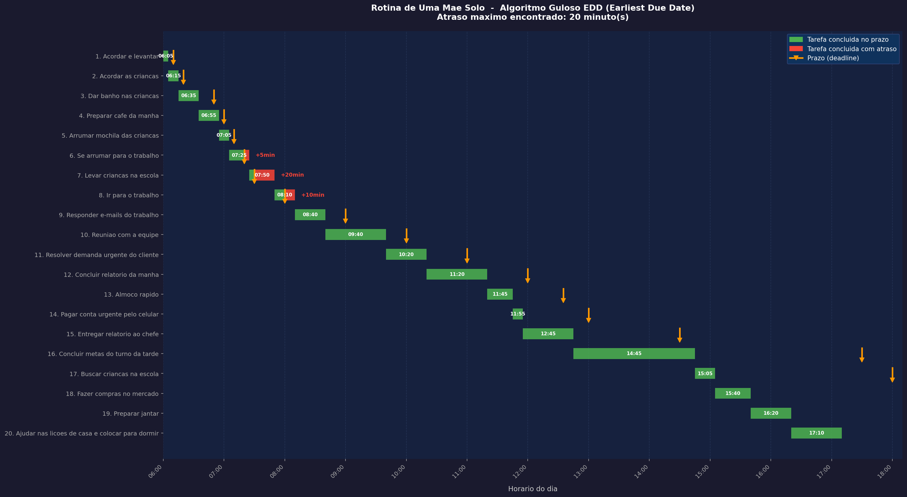

# Rotina de Uma Mae Solo — Organizador de Tarefas para Minimizar Atrasos

Projeto da disciplina **Projeto de Algoritmos** — implementação do algoritmo guloso **Earliest Due Date (EDD)** para minimizar o atraso máximo em um conjunto de tarefas diárias.

---

## Descrição do problema

Uma mãe solo precisa cuidar dos filhos, trabalhar e manter a casa. Ela acorda às **06:00** e tem uma série de tarefas com prazos rígidos: levar as crianças na escola às **07:30**, chegar ao trabalho às **08:00**, buscá-las às **18:00** e muito mais.

Qual é a melhor ordem de execução para que o maior atraso do dia seja o menor possível?

---

## O algoritmo guloso: Earliest Due Date (EDD)

O algoritmo **EDD** resolve o problema com uma escolha gulosa simples:

> **Sempre execute primeiro a tarefa com o menor prazo de entrega.**

A cada passo, em vez de analisar todas as combinações possíveis, o algoritmo escolhe localmente a tarefa mais urgente. Essa escolha local é globalmente ótima para minimizar o atraso máximo — resultado provado por troca de argumentos (exchange argument).

### Por que ordenar pelo menor prazo é uma escolha gulosa?

Imagine duas tarefas consecutivas `i` e `j` com `prazo_i < prazo_j`. Se executarmos `j` antes de `i`, a tarefa `i` ficará mais atrasada do que o necessário. Trocar as duas de ordem nunca piora o atraso máximo. Aplicando esse argumento a todas as trocas possíveis, chega-se à ordem EDD como globalmente ótima.

---

## Estrutura do projeto

```
greedy-atraso-maximo/
├── main.py          # Algoritmo EDD: leitura, ordenação e cálculo
├── visualizar.py    # Gráfico de Gantt interativo (matplotlib)
├── tarefas.csv      # 20 tarefas da rotina de uma mãe solo
├── test_main.py     # Testes automatizados com pytest
├── requirements.txt # Dependências (matplotlib + pytest)
└── .gitignore
```

---

## Como rodar o projeto

**Pré-requisitos:** Python 3.8 ou superior.

```bash
# 1. Clone ou baixe o repositório
git clone <url-do-repositorio>
cd greedy-atraso-maximo

# 2. (Opcional) Crie um ambiente virtual
python -m venv venv
venv\Scripts\activate      # Windows
# source venv/bin/activate  # Linux/macOS

# 3. Instale as dependências
pip install -r requirements.txt

# 4. Execute o programa no terminal
python main.py

# 5. Gere o gráfico de Gantt visual
python visualizar.py
```

---

## Como rodar os testes

```bash
pytest test_main.py -v
```

---

## Sobre o arquivo `tarefas.csv`

As colunas `duracao` e `prazo` são representadas em **minutos desde 06:00** (horário em que a mãe acorda). O programa converte automaticamente para o formato **HH:MM** na exibição.

| Horário real | Minutos desde 06:00 |
|---|---|
| 06:00 | 0 |
| 07:30 | 90 |
| 08:00 | 120 |
| 12:00 | 360 |
| 17:30 | 690 |
| 18:00 | 720 |

---

## Exemplo de entrada (`tarefas.csv`)

| id | nome | duracao | prazo |
|----|------|---------|-------|
| 1 | Acordar e levantar | 5 | 10 |
| 2 | Acordar as criancas | 10 | 20 |
| 3 | Dar banho nas criancas | 20 | 50 |
| 4 | Preparar cafe da manha | 20 | 60 |
| 5 | Arrumar mochila das criancas | 10 | 70 |
| 6 | Se arrumar para o trabalho | 20 | 80 |
| 7 | Levar criancas na escola | 25 | 90 |
| 8 | Ir para o trabalho | 20 | 120 |
| ... | ... | ... | ... |
| 20 | Ajudar nas licoes de casa e colocar para dormir | 50 | 900 |

---

## Exemplo de saída

**Terminal (`python main.py`):**

```
  Rotina do dia — horarios a partir das 06:00 | duracao e atraso em minutos

#     ID   Tarefa                                           Dur.    Prazo   Inicio  Termino   Atraso
----------------------------------------------------------------------------------------------------
1     1    Acordar e levantar                               5       06:10   06:00   06:05     -
2     2    Acordar as criancas                              10      06:20   06:05   06:15     -
3     3    Dar banho nas criancas                           20      06:50   06:15   06:35     -
4     4    Preparar cafe da manha                           20      07:00   06:35   06:55     -
5     5    Arrumar mochila das criancas                     10      07:10   06:55   07:05     -
6     6    Se arrumar para o trabalho                       20      07:20   07:05   07:25     5min
7     7    Levar criancas na escola                         25      07:30   07:25   07:50     20min
8     8    Ir para o trabalho                               20      08:00   07:50   08:10     10min
...
20    20   Ajudar nas licoes de casa e colocar para dormir  50      21:00   16:20   17:10     -

Atraso maximo encontrado: 20 minuto(s)
```

**O que o resultado mostra:**

Na correria da manhã, mesmo com o EDD organizando da melhor forma possível, a mãe chega **20 minutos atrasada na escola** e **10 minutos atrasada no trabalho**. A partir das 08:10, com a rotina estabilizada, todas as tarefas são cumpridas no prazo.

**Gráfico de Gantt (`python visualizar.py`):**



---

### Como ler o gráfico

O gráfico é um **diagrama de Gantt** — uma ferramenta clássica de gestão de tarefas adaptada aqui para visualizar o algoritmo EDD. Veja cada elemento:

#### Eixos

- **Eixo vertical (Y):** lista as 20 tarefas na ordem em que o algoritmo as executa — do menor prazo (topo) para o maior prazo (base). Essa é exatamente a ordenação EDD.
- **Eixo horizontal (X):** representa o horário real do dia, de **06:00** (quando a mãe acorda) até aproximadamente **17:10** (quando termina a última tarefa).

#### Legenda

| Elemento visual | O que representa |
|---|---|
| Barra **verde** | A tarefa foi executada inteiramente dentro do prazo |
| Barra **vermelha** | A parte da execução que ultrapassou o prazo — é o atraso visível |
| Barra **verde + vermelha** | A tarefa começou no prazo mas terminou depois — a divisão mostra exatamente onde o prazo foi cruzado |
| **Seta laranja** (▼) | O deadline daquela tarefa — o momento em que ela deveria estar concluída |
| **+Xmin** à direita | A quantidade de atraso em minutos daquela tarefa |
| Horário dentro da barra | O horário de término real da tarefa |

---

### Leitura tarefa por tarefa

#### Manhã — o período crítico (06:00 às 08:10)

As tarefas da manhã têm prazos muito próximos entre si. Pequenos atrasos se acumulam e criam um efeito cascata:

| # | Tarefa | Início | Término | Prazo | Situação |
|---|---|---|---|---|---|
| 1 | Acordar e levantar | 06:00 | 06:05 | 06:10 | ✅ No prazo |
| 2 | Acordar as crianças | 06:05 | 06:15 | 06:20 | ✅ No prazo |
| 3 | Dar banho nas crianças | 06:15 | 06:35 | 06:50 | ✅ No prazo |
| 4 | Preparar café da manhã | 06:35 | 06:55 | 07:00 | ✅ No prazo |
| 5 | Arrumar mochila das crianças | 06:55 | 07:05 | 07:10 | ✅ No prazo |
| 6 | Se arrumar para o trabalho | 07:05 | 07:25 | 07:20 | ⚠️ **+5min de atraso** |
| 7 | Levar crianças na escola | 07:25 | 07:50 | 07:30 | 🔴 **+20min de atraso** |
| 8 | Ir para o trabalho | 07:50 | 08:10 | 08:00 | 🔴 **+10min de atraso** |

**O que o gráfico mostra aqui:** as tarefas 1 a 5 têm barras totalmente verdes — todas no prazo. Na tarefa 6, a barra é verde até 07:20 (prazo) e vermelha dos 07:20 aos 07:25 — o pequeno trecho vermelho é o atraso de 5 minutos. Como as tarefas são sequenciais, esse atraso empurra tudo que vem depois: as tarefas 7 e 8 já começam atrasadas e suas barras são inteiramente vermelhas.

> O **efeito cascata** fica visível no gráfico: as barras vermelhas surgem exatamente onde o tempo total das tarefas supera a janela disponível da manhã.

#### Trabalho — período estável (08:10 às 14:45)

A partir das 08:10 o dia se estabiliza. As tarefas do trabalho têm prazos mais espaçados, o que dá margem suficiente para executá-las sem atraso:

| # | Tarefa | Término | Prazo | Situação |
|---|---|---|---|---|
| 9 | Responder e-mails | 08:40 | 09:00 | ✅ No prazo |
| 10 | Reunião com a equipe | 09:40 | 10:00 | ✅ No prazo |
| 11 | Resolver demanda urgente | 10:20 | 11:00 | ✅ No prazo |
| 12 | Concluir relatório da manhã | 11:20 | 12:00 | ✅ No prazo |
| 13 | Almoço rápido | 11:45 | 12:35 | ✅ No prazo |
| 14 | Pagar conta urgente | 11:55 | 13:00 | ✅ No prazo |
| 15 | Entregar relatório ao chefe | 12:45 | 14:30 | ✅ No prazo |
| 16 | Concluir metas do turno da tarde | 14:45 | 17:30 | ✅ No prazo |

**O que o gráfico mostra aqui:** todas as barras são totalmente verdes. As setas laranjas estão sempre à direita do término das barras — isso confirma que cada tarefa termina antes do seu prazo. Note que a tarefa 16 (concluir metas da tarde) tem a barra mais longa do gráfico, representando 2 horas de trabalho contínuo, mas ainda assim termina às 14:45 — bem antes do prazo das 17:30.

#### Tarde e noite — conforto total (14:45 às 17:10)

As tarefas após o trabalho têm bastante folga, pois a mãe termina suas obrigações profissionais cedo:

| # | Tarefa | Término | Prazo | Situação |
|---|---|---|---|---|
| 17 | Buscar crianças na escola | 15:05 | 18:00 | ✅ No prazo |
| 18 | Fazer compras no mercado | 15:40 | 19:00 | ✅ No prazo |
| 19 | Preparar jantar | 16:20 | 19:30 | ✅ No prazo |
| 20 | Ajudar nas lições e colocar para dormir | 17:10 | 21:00 | ✅ No prazo |

**O que o gráfico mostra aqui:** as barras da tarde são verdes e curtas em relação ao espaço disponível — há folga visível entre o término de cada barra e a seta laranja do prazo correspondente. Isso mostra que o algoritmo EDD conseguiu "salvar" o resto do dia, mesmo com os atrasos da manhã.

---

### Conclusão do gráfico

O gráfico deixa três mensagens claras:

1. **O gargalo é a manhã.** Toda a zona vermelha se concentra entre 06:00 e 08:10. Fora desse intervalo, nenhuma tarefa atrasa.
2. **O efeito cascata é real.** Um atraso de apenas 5 minutos em uma tarefa pode se propagar e virar 20 minutos de atraso na tarefa seguinte.
3. **O EDD é ótimo.** Nenhuma outra ordem de execução produziria um atraso máximo menor que **20 minutos**. O algoritmo garante isso matematicamente.

O arquivo `cronograma.png` é gerado e salvo automaticamente ao rodar `python visualizar.py`.

---

## Complexidade do algoritmo

| Etapa | Complexidade |
|---|---|
| Leitura do CSV | O(n) |
| Ordenação (EDD) | O(n log n) |
| Cálculo do cronograma | O(n) |
| **Total** | **O(n log n)** |

O gargalo é a ordenação. Para `n` tarefas, o algoritmo é eficiente mesmo para entradas grandes.

---

## Vídeo de apresentação

> Substitua `ID_DO_VIDEO` pelo ID do vídeo publicado no YouTube.

[](https://www.youtube.com/watch?v=ID_DO_VIDEO)

> **Nota:** O GitHub não renderiza `<iframe>` diretamente em Markdown. A forma mais segura e compatível é usar uma imagem clicável que redireciona para o YouTube, como mostrado acima.

---

## Autor

| Nome | Matrícula |
|---|---|
| Arthur Carvalho Leite | 222037595 |

Projeto desenvolvido para a disciplina **Projeto de Algoritmos**.
